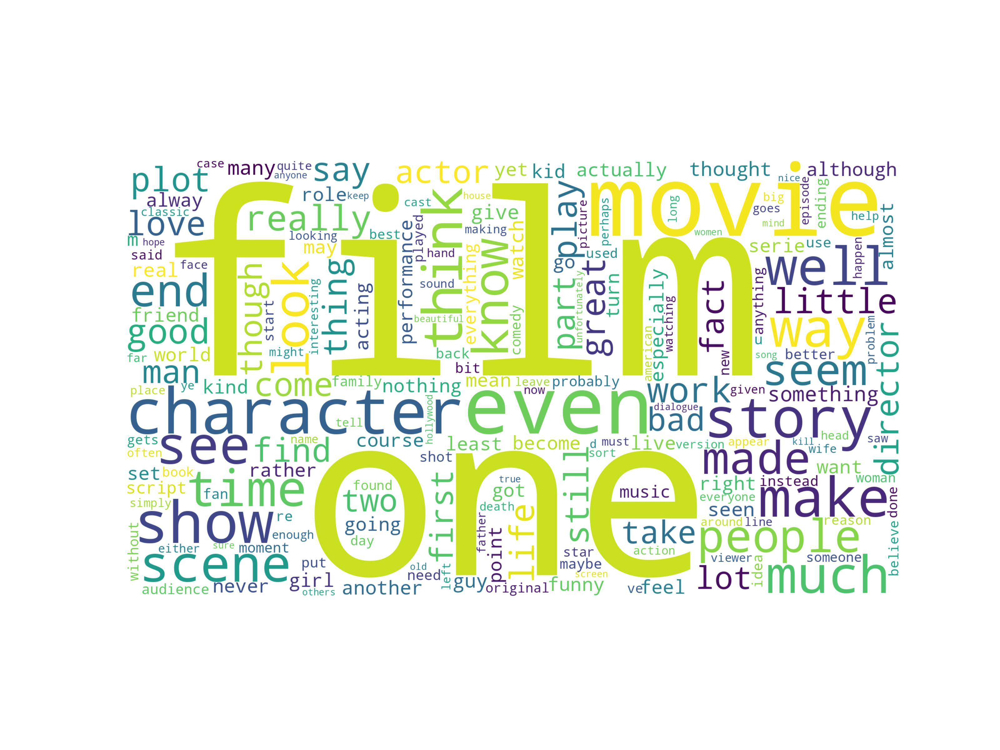
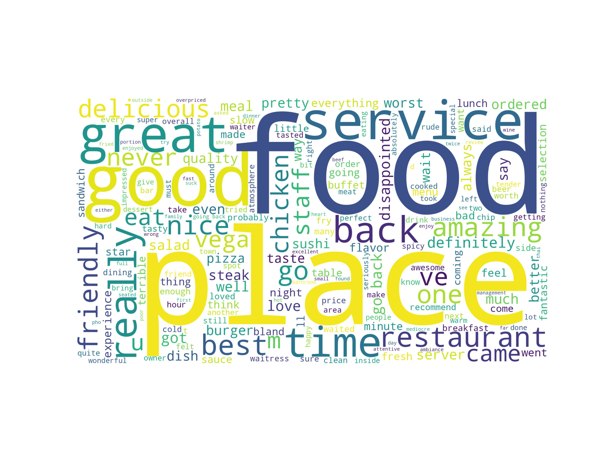
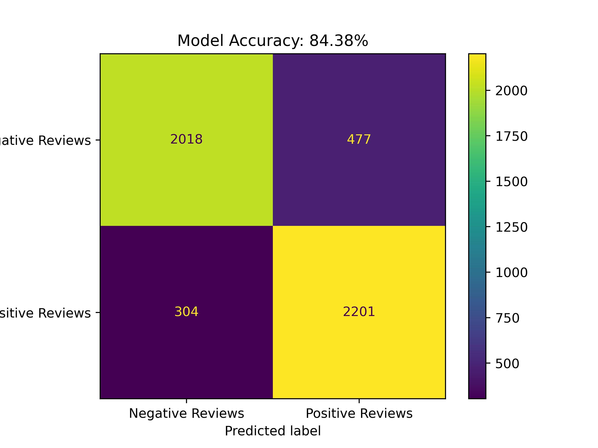
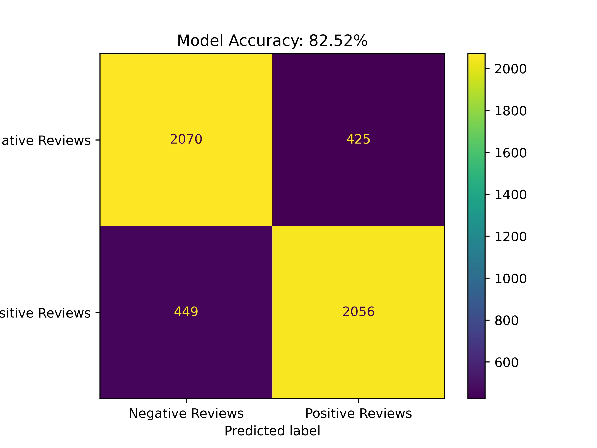
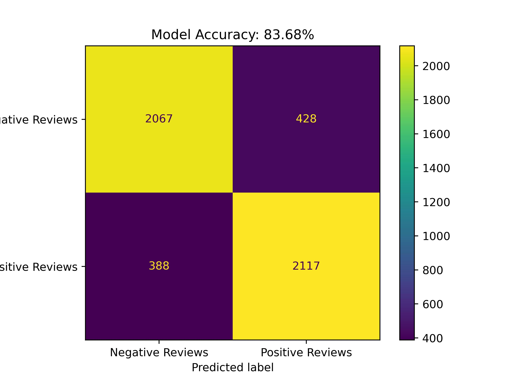
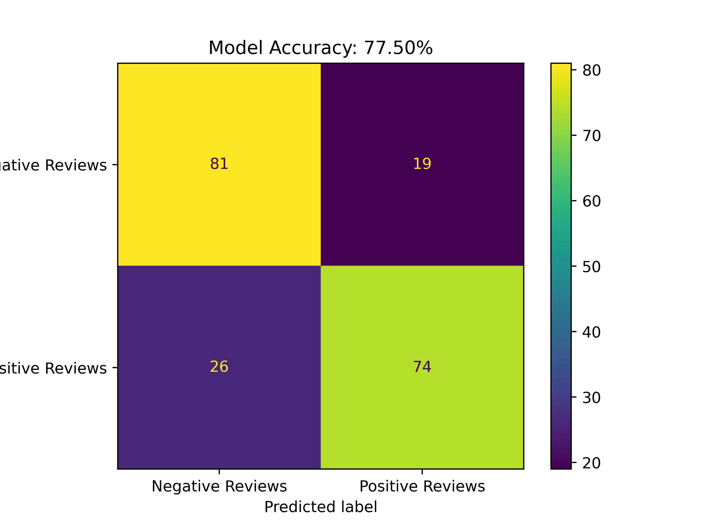
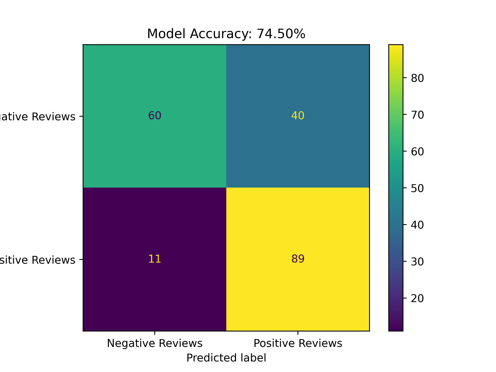
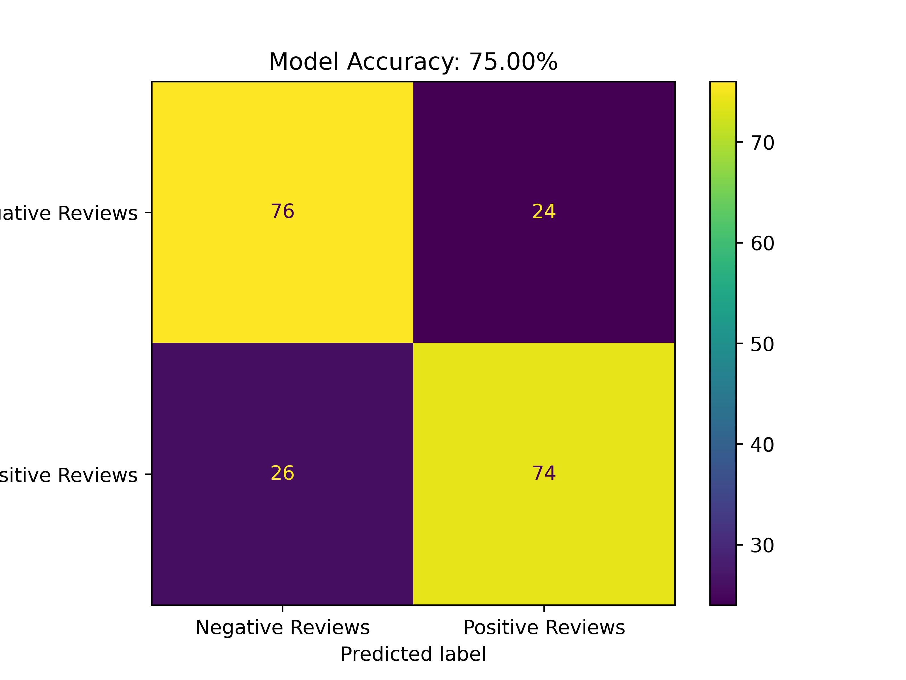

# Sentiment Analysis

Delivered a sentiment analysis project that uses 2 different datasets taken from Kaggle:

1. [IMDB Movie review dataset](https://www.kaggle.com/datasets/columbine/imdb-dataset-sentiment-analysis-in-csv-format)
   1. contains 1000 reviews
   2. Binary classes dataset - 1 or 0
   3. Word cloud 
2. [Restaurant food review dataset](https://www.kaggle.com/datasets/vigneshwarsofficial/reviews)
   1. contain 3 files
      1. `Train.csv` - 40,000 reviews
      2. `Test.csv` - 5,000 reviews
      3. `Valid.csv` - 5,0000 reviews
   2. Binary classes dataset - 1 or 0
   3. Word cloud 

perform feature engineering from `sklearn.feature_extraction.text`

1. `CountVectorizer` - bag of words
2. `TfidfTransformer` - calculate TF-IDF on the bag of words matrix
3. `SelectKBest`, `chi2` from `sklearn.feature_selection`

and then train 3 machine learning models:

1. Support Vector Classifier from `sklearn.svm.LinearSVC`
2. Random Forest from `sklearn.ensemble.RandomForestClassifier`
3. Multinomial Naive Bayes from `sklearn.naive_bayes.MultinomialNB`

finally, compare the performance of all models using

1. from `sklearn.metrics.classification_report`
2. from `sklearn.metrics.confusion_matrix`, `sklearn.metrics.ConfusionMatrixDisplay`

added a [short report](/report/Experimental Report.pdf) here as well.

## Evaluation

Dataset Name | SVC         | Random Forest     | Multinomial NB |
|------------|--------------|-----------|------------|
|IMDB movie reivews dataset|  |       |         |
|Resturant Reviews dataset|       |   |        |

## Author

[https://github.com/MasterHM-ml/](https://github.com/MasterHM-ml/)
